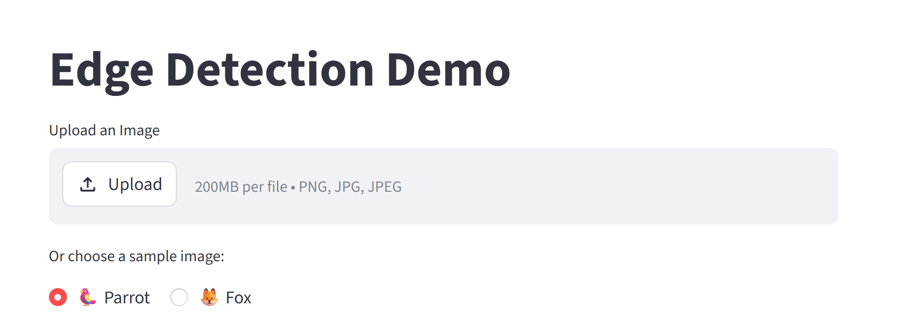

# Edge Detection Demo

An interactive Streamlit app that teaches edge detection concepts through hands-on parameter exploration. Users can upload their own images (or use the built-in sample) and compare three classical algorithms — Sobel, Laplacian, and Canny — side by side with live diagnostics.

---

## Features

- Upload any PNG/JPG image, or use the built-in sample image
- Tune Gaussian blur kernel size and sigma for each detector
- Adjust Canny hysteresis thresholds (low and high) interactively
- Side-by-side comparison: original / edge map / colour overlay
- Quantitative metrics per detector: edge density, fragment count, average fragment length
- Inline interpretation of what each metric value means

---

## Project Structure

```
image_analysis_app/
├── app.py                  # Main Streamlit application
├── processing.py           # Edge detection algorithms (Sobel, Laplacian, Canny)
├── metrics.py              # Quantitative metric computation
├── utils.py                # Utility / helper functions
├── requirements.txt        # Python dependencies
├── docs/
│   └── design_choices.md   # Algorithm & UI design notes
├── sample_images/
│   ├── parrot.jpg          # Built-in sample image
│   └── fox.jpg             # Built-in sample image
└── image/
    └── README/     
```

---

## Local Run Instructions

**Requirements:** Python ≥ 3.11

```bash
# 1. Clone the repository
git clone <your-repo-url>
cd image_analysis_app

# 2. Create and activate a virtual environment (optional but recommended)
python -m venv .venv
# Windows
.venv\Scripts\activate
# macOS/Linux
source .venv/bin/activate

# 3. Install dependencies
pip install -r requirements.txt

# 4. Run the app
streamlit run app.py
```

The app will open automatically at `http://localhost:8501`.

---

## Hugging Face Space

> 🔗 **Live demo:** [Edge Detection Demo - a Hugging Face Space by Susan-L18](https://huggingface.co/spaces/Susan-L18/Image_Analysis_App)

Deployed on Hugging Face Spaces using the Streamlit SDK.

---

## Screenshots

Press the Upload button, upload your own image for edge dectection, or choose the build-in images(Parrot or Fox) to explore.



You can tune the parameters for each detector to explore, and side-by-side comparison: original / edge map / colour overlay


Quantitative metrics per detector: edge density, fragment count, average fragment length


---

## Known Limitations

- **Sobel / Laplacian metrics use a fixed 90th-percentile threshold** to binarise the magnitude map. This makes density values comparable across images but may not match a visually chosen threshold.
- **Large images (> ~4 MP)** may cause slow recomputation on every slider interaction; consider downscaling before uploading.
- **Transparency / RGBA images** are automatically converted to RGB on upload; the alpha channel is discarded.
- **Canny is not suited for colour images** — the app converts to greyscale before detection, so colour-specific edge information is lost.
- All three detectors work in greyscale; colour-aware edge detection (e.g. Di Zenzo gradient) is out of scope.

---

## Design Notes

See [docs/design_choices.md](docs/design_choices.md) for a short discussion of algorithm choices, metric design, and UI decisions.

## Contact

For questions or issues regarding this app, please contact: [jiajing.li@students.unibe.ch]()
